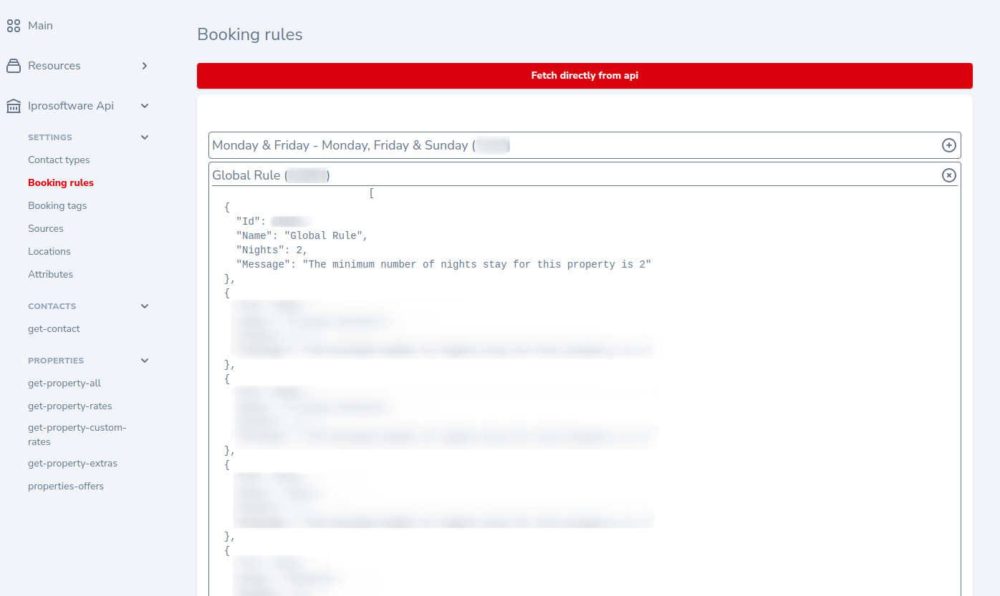

# Laravel nova iprosoftware-api preview.

[](https://github.com/yaroslawww/nova-iprosoftware-api/blob/main/LICENSE.md)
[](https://packagist.org/packages/yaroslawww/nova-iprosoftware-api)
[](https://packagist.org/packages/yaroslawww/nova-iprosoftware-api)
[](https://scrutinizer-ci.com/g/yaroslawww/nova-iprosoftware-api/build-status/main)
[](https://scrutinizer-ci.com/g/yaroslawww/nova-iprosoftware-api/?branch=main)
[](https://scrutinizer-ci.com/g/yaroslawww/nova-iprosoftware-api/?branch=main)

| Nova  | Package |
|-------|---------|
| V4    | V1      |

### Install

```bash
composer require yaroslawww/nova-iprosoftware-api
```


